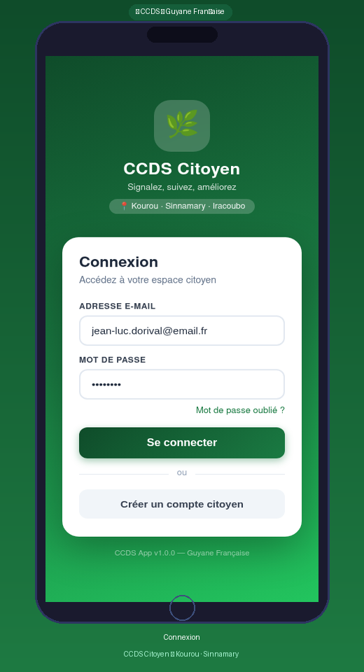
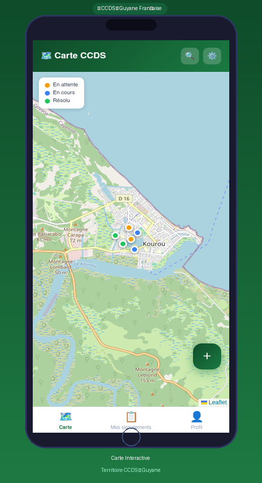
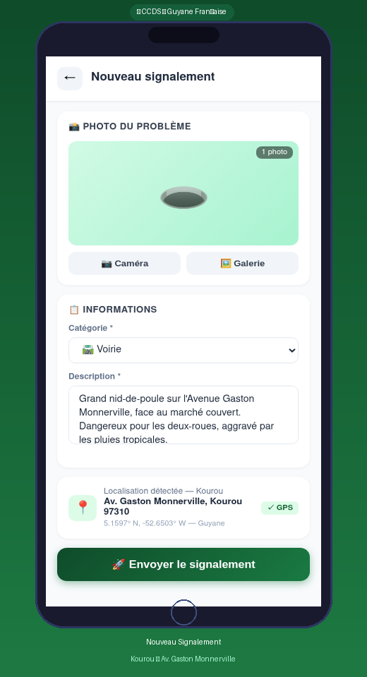
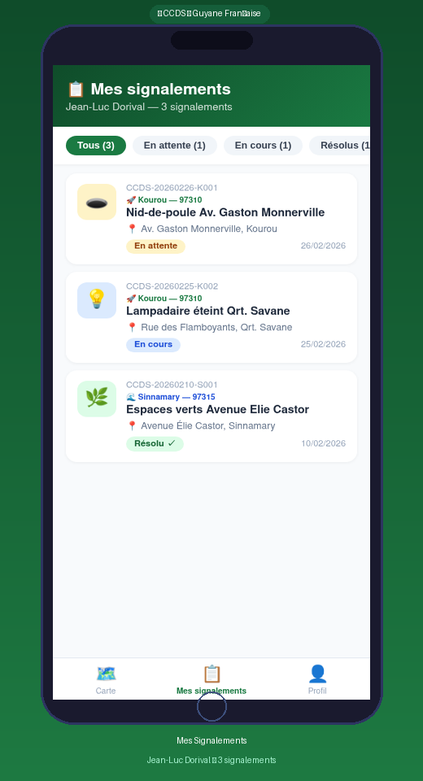
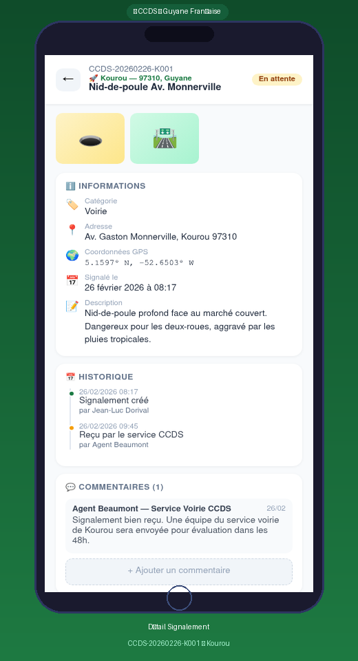
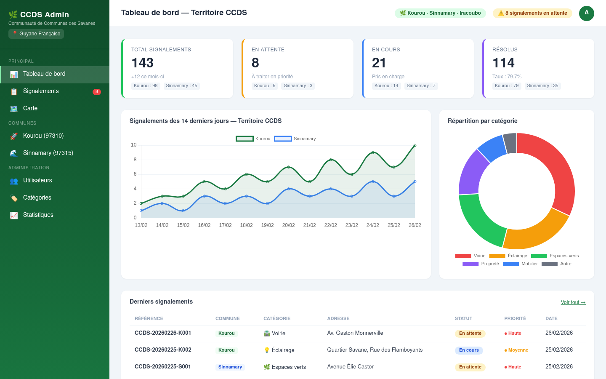
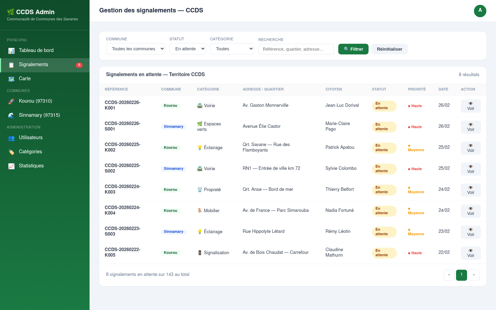
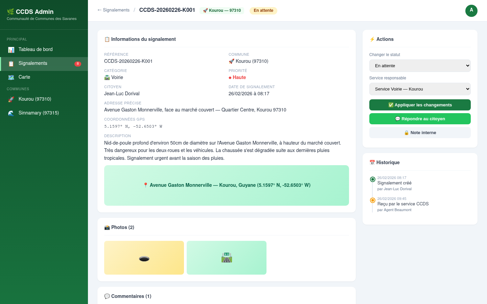
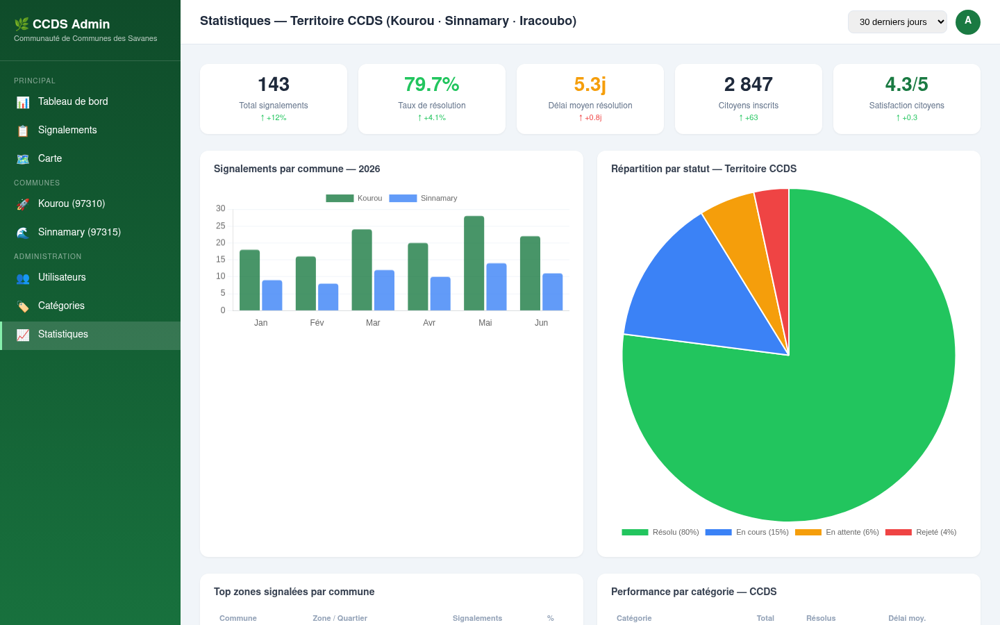
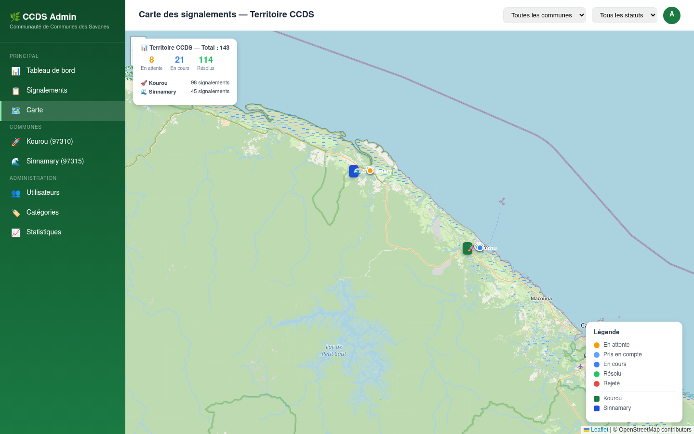

# Galerie Visuelle — CCDS App Citoyenne (Guyane)

> **Générée le :** 26 Février 2026 | **Version :** 1.1.0 (Kourou/Sinnamary) | **Outil :** Playwright + Python/Pillow

Cette galerie présente l'ensemble des interfaces du projet **CCDS Citoyen**, personnalisées pour le territoire de la **Communauté de Communes des Savanes** (Kourou, Sinnamary, Iracoubo, Saint-Élie).

---

## 📱 Application Mobile Citoyenne (iOS & Android)

L'application mobile permet aux citoyens de signaler les problèmes en temps réel, avec une identité visuelle ancrée dans le territoire guyanais.

### 1. Connexion & Identité Territoriale
> Écran de connexion sécurisé avec l'identité visuelle de la CCDS et un dégradé vert forêt.

### 2. Carte Interactive (Kourou & Sinnamary)
> Visualisation des signalements sur tout le territoire, de l'Avenue des Roches à Kourou jusqu'au bourg de Sinnamary.

### 3. Création de Signalement
> Formulaire ultra-rapide avec géolocalisation automatique (Ex: Avenue Gaston Monnerville, Kourou).

### 4. Mes Signalements
> Suivi personnalisé de l'avancement des demandes pour chaque citoyen.

### 5. Détail & Transparence
> Historique complet et dialogue avec les services techniques (Ex: Réponse de l'Agent Beaumont).

---

## 🖥️ Back-Office Web d'Administration

L'outil de pilotage pour les services techniques de Kourou et Sinnamary.

### 6. Tableau de Bord Territoire
> Vue d'ensemble des indicateurs clés de performance par commune (Kourou vs Sinnamary).

### 7. Gestion des Signalements
> Liste filtrable des demandes citoyennes avec badges de commune.

### 8. Traitement d'un Incident
> Interface de gestion complète pour les agents (Ex: Nid-de-poule Av. Monnerville).

### 9. Statistiques & Performance
> Analyse des délais de résolution et satisfaction citoyenne sur le territoire des Savanes.

### 10. Cartographie Opérationnelle
> Vue satellite et thermique des zones d'intervention sur la carte de la Guyane.

---

## 📊 Récapitulatif des Interfaces

| # | Interface | Type | Plateforme | Contenu |
|---|---|---|---|---|
| 1 | Connexion | App | Mobile | Identité CCDS Guyane |
| 2 | Carte | App | Mobile | Kourou & Sinnamary |
| 3 | Création | App | Mobile | Av. Gaston Monnerville |
| 4 | Mes signalements | App | Mobile | Suivi citoyen |
| 5 | Détail | App | Mobile | Historique complet |
| 6 | Tableau de bord | Admin | Web | KPIs par commune |
| 7 | Liste | Admin | Web | Filtres territoriaux |
| 8 | Détail incident | Admin | Web | Traitement voirie |
| 9 | Statistiques | Admin | Web | Performance services |
| 10 | Carte admin | Admin | Web | Vue globale |

---

*Galerie générée automatiquement par le pipeline de documentation visuelle CCDS.*
*Outil : Playwright (captures headless) + Python/Pillow (maquettes smartphone)*
