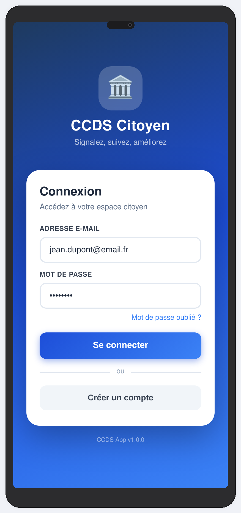
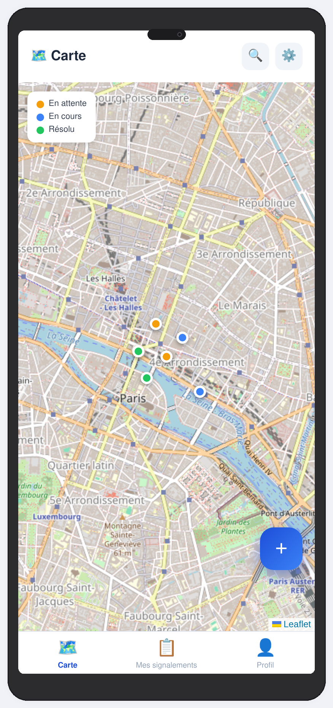
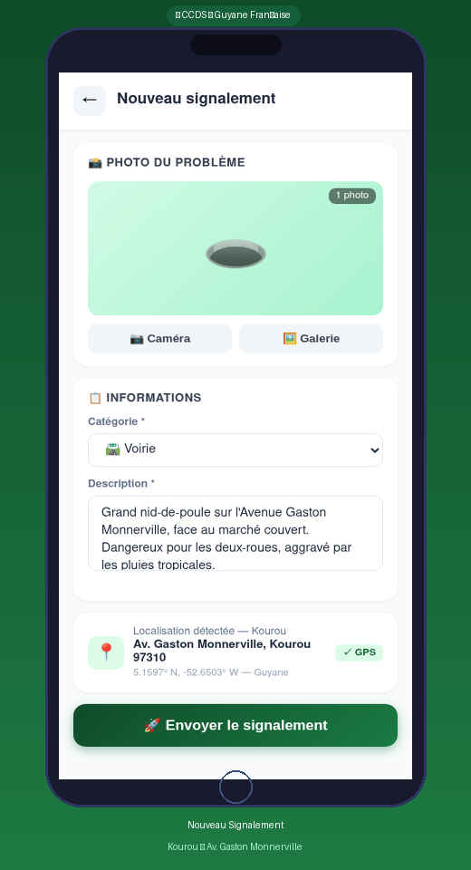
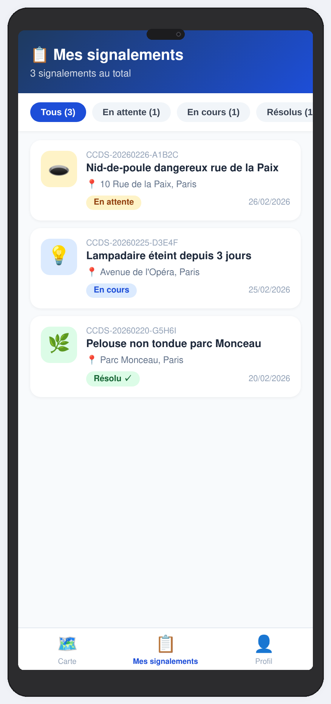
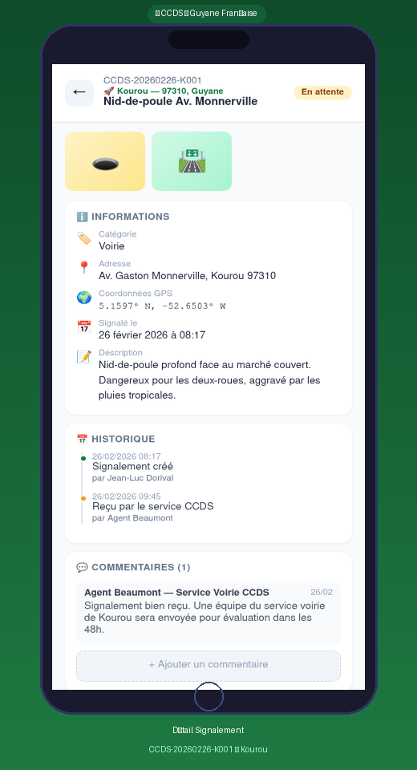
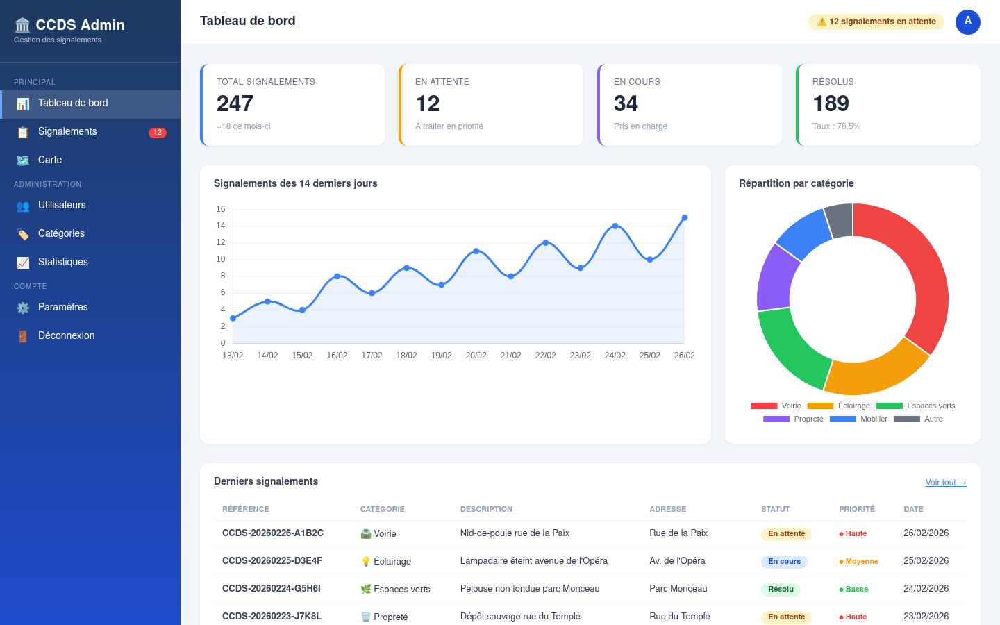
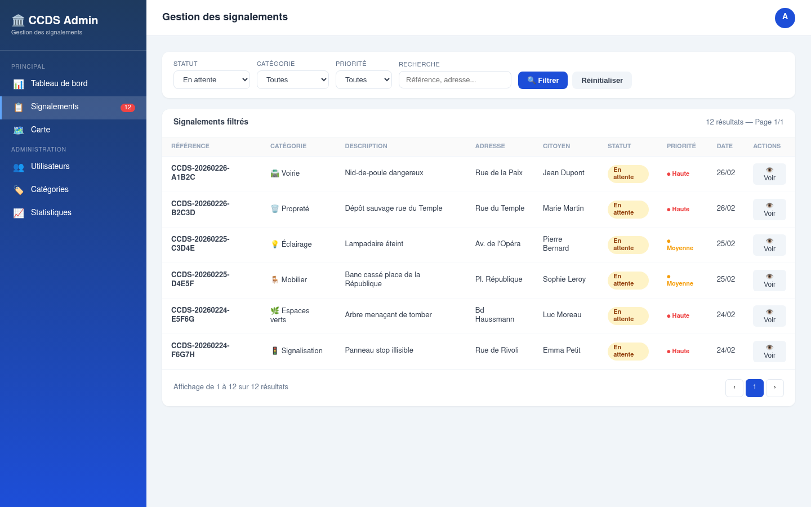
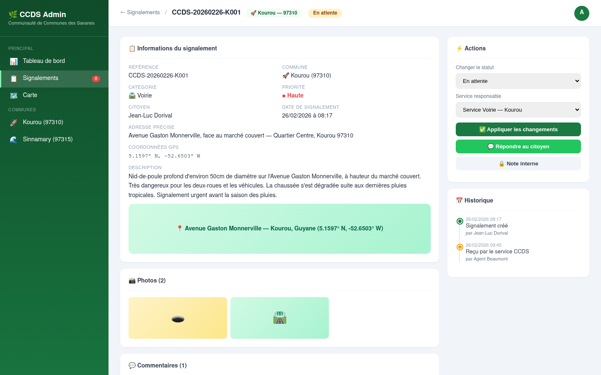
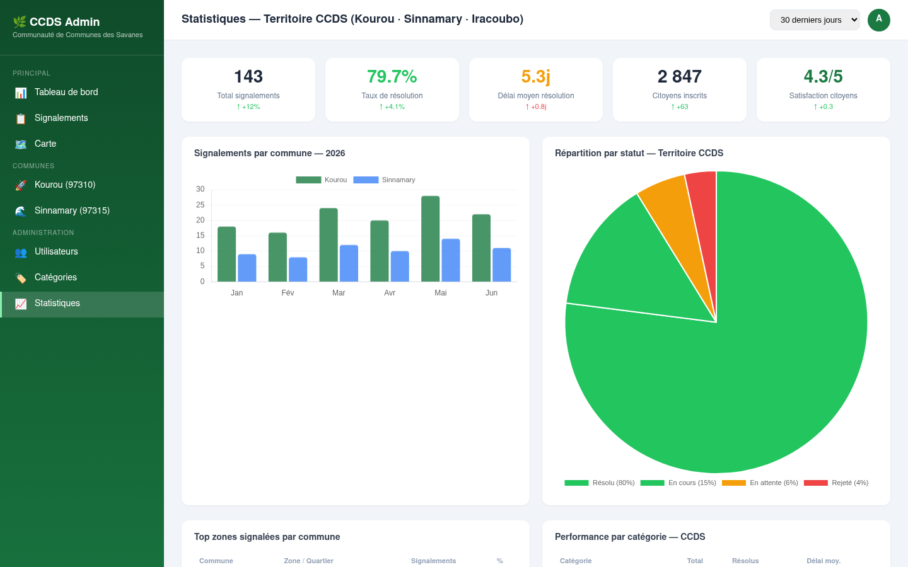
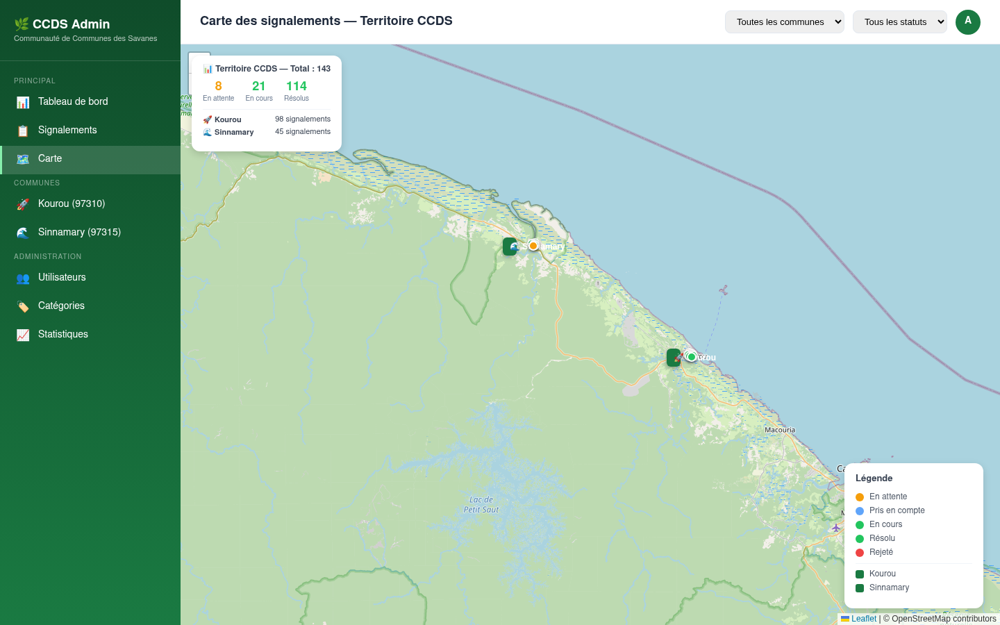

# Galerie Visuelle — Ma Commune (Guyane)

> **Générée le :** 26 Février 2026 | **Référence :** galerie héritée à actualiser | **Outil :** Playwright + Python/Pillow

Cette galerie présente un lot de captures historiques du projet, à relire désormais sous l'identité **Ma Commune**.

Les visuels restent utiles pour montrer l'étendue des surfaces, mais ils ne doivent plus être lus comme une promesse produit exhaustive ni comme une identité finale figée.

---

## 📱 Application Mobile Citoyenne (iOS & Android)

L'application mobile permet aux habitants de signaler un besoin local, suivre sa prise en charge et retrouver une preuve d'action communale.

### 1. Connexion & Identité Territoriale
> Écran de connexion sécurisé avec une identité territoriale guyanaise.

### 2. Carte Interactive
> Visualisation des signalements et du maillage territorial.

### 3. Création de Signalement
> Formulaire ultra-rapide avec géolocalisation automatique (Ex: Avenue Gaston Monnerville, Kourou).

### 4. Mes Signalements
> Suivi personnalisé de l'avancement des demandes pour chaque citoyen.

### 5. Détail & Transparence
> Historique complet et dialogue avec les services techniques.

---

## 🖥️ Back-Office Web d'Administration

L'outil de pilotage pour les services techniques et la supervision communale.

### 6. Tableau de Bord Territoire
> Vue d'ensemble des indicateurs clés de suivi.

### 7. Gestion des Signalements
> Liste filtrable des demandes citoyennes et priorités de traitement.

### 8. Traitement d'un Incident
> Interface de gestion complète pour les agents.

### 9. Statistiques & Performance
> Analyse des délais de résolution et de l'activité de service.

### 10. Cartographie Opérationnelle
> Vue de pilotage géographique des zones d'intervention.

---

## 📊 Récapitulatif des Interfaces

| # | Interface | Type | Plateforme | Contenu |
|---|---|---|---|---|
| 1 | Connexion | App | Mobile | Identité Ma Commune |
| 2 | Carte | App | Mobile | Vision territoriale |
| 3 | Création | App | Mobile | Av. Gaston Monnerville |
| 4 | Mes signalements | App | Mobile | Suivi citoyen |
| 5 | Détail | App | Mobile | Historique complet |
| 6 | Tableau de bord | Admin | Web | KPIs de suivi |
| 7 | Liste | Admin | Web | Filtres et priorités |
| 8 | Détail incident | Admin | Web | Traitement voirie |
| 9 | Statistiques | Admin | Web | Performance service |
| 10 | Carte admin | Admin | Web | Vue globale |

---

*Galerie générée automatiquement par un pipeline documentaire historique, à remettre à jour lors de la prochaine passe de captures.*
*Outil : Playwright (captures headless) + Python/Pillow (maquettes smartphone)*
