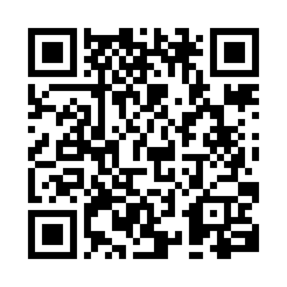
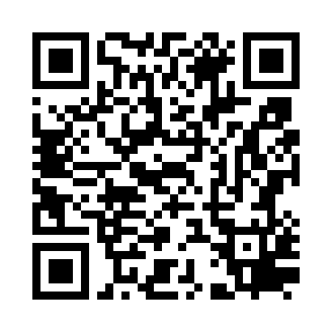

# Guide d'Installation — CCDS Citoyen

> **Public Cible :** Citoyens de Kourou, Sinnamary, Iracoubo et Saint-Élie
> **Objectif :** Télécharger, installer et se connecter à l'application pour la première fois.

---

## Bienvenue sur CCDS Citoyen !

L'application officielle de la Communauté de Communes des Savanes pour signaler les anomalies, suivre leur résolution et contribuer à l'amélioration de notre cadre de vie.

## 1. Téléchargez l'Application

Scannez le QR Code correspondant à votre smartphone avec votre appareil photo.

<table align="center">
  <tr>
    <td align="center">
      
       
      <strong>Pour iPhone (iOS)</strong>
    </td>
    <td align="center">
      
       
      <strong>Pour Android (Samsung, Google, etc.)</strong>
    </td>
  </tr>
</table>

Appuyez sur le lien qui apparaît à l'écran pour ouvrir la page de téléchargement.

---

## 2. Installez l'Application

| Étape | Action | Visuel |
|---|---|---|
| **1** | Appuyez sur le bouton **"Obtenir"** (sur iPhone) ou **"Installer"** (sur Android). | 📲 |
| **2** | L'application va se télécharger et s'installer automatiquement. | ⏳ |
| **3** | Une fois terminée, une nouvelle icône **"CCDS Citoyen"** 🌿 apparaît sur votre écran d'accueil. | ✅ |

---

## 3. Première Connexion

1.  **Ouvrez l'application** en appuyant sur la nouvelle icône 🌿.
2.  Sur l'écran de bienvenue, appuyez sur **"Créer un compte citoyen"**.
3.  Remplissez le formulaire avec votre nom complet, votre adresse e-mail et un mot de passe.
4.  Appuyez sur **"Créer mon compte"**.
5.  C'est fait ! Vous êtes maintenant connecté et prêt à effectuer votre premier signalement.

> **Besoin d'aide ?**
> En cas de difficulté, n'hésitez pas à contacter les services de la CCDS.
