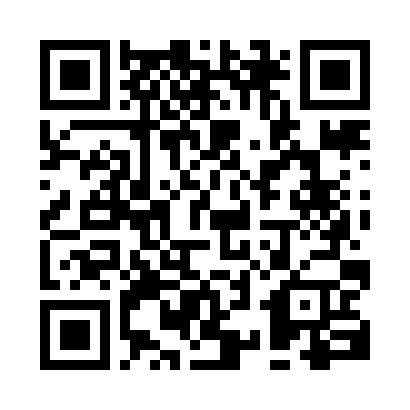
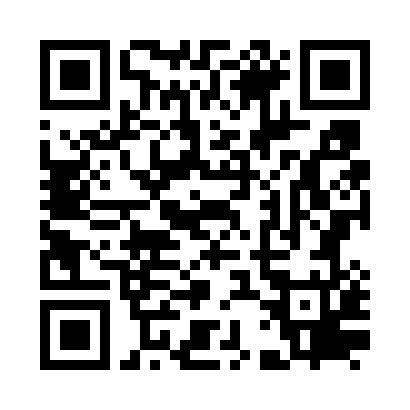

# Guide d'Installation — Ma Commune

> **Public cible :** Habitants de la commune pilote
> **Objectif :** Installer l'application, configurer l'accès au serveur communal et effectuer une première connexion.

---

## Bienvenue sur Ma Commune

`Ma Commune` permet de signaler un problème utile au territoire, de suivre sa prise en charge et de retrouver la preuve d'action des services.

## 1. Téléchargez l'application

Scannez le QR Code correspondant à votre smartphone avec votre appareil photo, ou ouvrez le lien d'installation communiqué par la commune.

<table align="center">
  <tr>
    <td align="center">
      
       
      <strong>Pour iPhone (iOS)</strong>
    </td>
    <td align="center">
      
       
      <strong>Pour Android (Samsung, Google, etc.)</strong>
    </td>
  </tr>
</table>

Appuyez sur le lien qui apparaît à l'écran pour ouvrir la page de téléchargement ou d'installation.

---

## 2. Installez l'application

| Étape | Action | Visuel |
|---|---|---|
| **1** | Appuyez sur le bouton **"Obtenir"** (sur iPhone) ou **"Installer"** (sur Android). | 📲 |
| **2** | L'application va se télécharger et s'installer automatiquement. | ⏳ |
| **3** | Une fois terminée, une nouvelle icône **"Ma Commune"** 🌿 apparaît sur votre écran d'accueil. | ✅ |

---

## 3. Première configuration

Au premier lancement, l'application peut demander l'adresse du serveur communal.

Si votre commune ou votre agent de déploiement vous a transmis une adresse spécifique, saisissez-la.

Exemple local de démonstration :

- `http://127.0.0.1:8080/api`

Appuyez ensuite sur **"Tester la connexion"**, puis sur **"Enregistrer et continuer"**.

---

## 4. Première connexion

1.  **Ouvrez l'application** en appuyant sur la nouvelle icône 🌿.
2.  Sur l'écran de bienvenue, appuyez sur **"Créer un compte citoyen"**.
3.  Remplissez le formulaire avec votre nom complet, votre adresse e-mail et un mot de passe.
4.  Appuyez sur **"Créer mon compte"**.
5.  C'est fait ! Vous êtes maintenant connecté et prêt à effectuer votre premier signalement.

> **Besoin d'aide ?**
> En cas de difficulté, contactez votre mairie ou l'administrateur local de `Ma Commune`.
